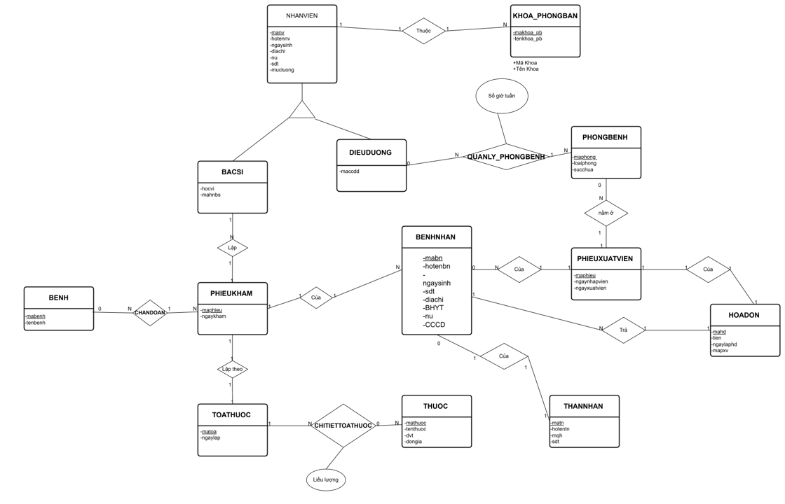

# 🏥 Hệ Thống Quản Lý Bệnh Viện (Hospital Management Database)

Cơ sở dữ liệu quan hệ được thiết kế để quản lý hoạt động bệnh viện bao gồm hồ sơ bệnh nhân, lịch khám bệnh, đơn thuốc, lịch trực của điều dưỡng và hóa đơn thanh toán.

---

## 📋 Mục Lục
- [Tổng quan](#tổng-quan)
- [Sơ đồ ERD](#sơ-đồ-erd)
- [Schema cơ sở dữ liệu](#schema-cơ-sở-dữ-liệu)
- [Ràng buộc toàn vẹn & Trigger](#ràng-buộc-toàn-vẹn--trigger)
- [Các câu truy vấn mẫu](#các-câu-truy-vấn-mẫu)
- [Hướng dẫn cài đặt](#hướng-dẫn-cài-đặt)
- [Cấu trúc thư mục](#cấu-trúc-thư-mục)
- [Công nghệ sử dụng](#công-nghệ-sử-dụng)
- [Chuẩn hóa dữ liệu](#chuẩn-hóa-dữ-liệu)

---

## Tổng Quan

Hệ thống gồm các module chính:

- **Quản lý nhân sự** — Bác sĩ, điều dưỡng và nhân viên hành chính được tổ chức theo khoa/phòng ban
- **Quản lý bệnh nhân** — Hồ sơ bệnh nhân, lịch sử khám bệnh và thông tin thân nhân
- **Quản lý khám bệnh** — Phiếu khám, chẩn đoán và kê đơn thuốc
- **Quản lý phòng bệnh** — Nhập viện, phân phòng và xuất viện
- **Hóa đơn** — Lập hóa đơn thanh toán gắn với phiếu xuất viện

---

## Sơ Đồ ERD



---

## Schema Cơ Sở Dữ Liệu

Hệ thống gồm **15 bảng**:

| Bảng | Mô tả |
|---|---|
| `KHOA_PHONGBAN` | Các khoa và phòng ban trong bệnh viện |
| `NHANVIEN` | Thông tin tất cả nhân viên |
| `BACSI` | Thông tin riêng của bác sĩ (học vị, mã hành nghề) |
| `DIEUDUONG` | Thông tin riêng của điều dưỡng (mã chứng chỉ) |
| `QUANLY_PHONGBENH` | Phân công điều dưỡng quản lý phòng bệnh và số giờ trực |
| `PHONGBENH` | Thông tin phòng bệnh (loại phòng, sức chứa) |
| `BENHNHAN` | Hồ sơ bệnh nhân |
| `THANNHAN` | Thông tin thân nhân bệnh nhân |
| `PHIEUKHAM` | Phiếu khám bệnh |
| `BENH` | Danh mục bệnh |
| `CHANDOAN` | Chẩn đoán — liên kết phiếu khám với bệnh |
| `TOATHUOC` | Toa thuốc |
| `THUOC` | Danh mục thuốc |
| `CHITIETTOATHUOC` | Chi tiết toa thuốc (thuốc + liều lượng) |
| `PHIEUXUATVIEN` | Phiếu xuất viện |
| `HOADON` | Hóa đơn thanh toán |

### Các mối quan hệ chính
- Mỗi **nhân viên** thuộc đúng một khoa/phòng ban; mỗi khoa/phòng ban phải có ít nhất một nhân viên
- Mỗi **bác sĩ** có thể lập nhiều phiếu khám; mỗi phiếu khám chỉ do một bác sĩ lập
- Mỗi **điều dưỡng** có thể quản lý một hoặc nhiều phòng bệnh
- Mỗi **bệnh nhân** có tối đa một thân nhân được lưu trong hệ thống
- Mỗi **phiếu khám** tương ứng với một toa thuốc
- Mỗi **phiếu xuất viện** tương ứng với một hóa đơn

---

## Ràng Buộc Toàn Vẹn & Trigger

6 trigger được xây dựng để đảm bảo các ràng buộc nghiệp vụ:

| # | Ràng buộc | Trigger | Bảng |
|---|---|---|---|
| 1 | Tổng số giờ trực trong tuần của mỗi điều dưỡng không vượt quá 48 giờ | `GHTG_QLP` | `QUANLY_PHONGBENH` |
| 2 | Ngày xuất viện phải sau ngày nhập viện | `TG_N_X_VIEN` | `PHIEUXUATVIEN` |
| 3a | Ngày lập hóa đơn phải trong hoặc sau ngày xuất viện, nhưng không quá 1 ngày | `TR_NgayLapHoaDon` | `HOADON` |
| 3b | Cập nhật ngày xuất viện không được vi phạm ngày lập hóa đơn đã có | `TR_NLHD` | `PHIEUXUATVIEN` |
| 4 | Lương tối thiểu của nhân viên phải từ 4.680.000 VNĐ trở lên | `MIN_SALARY` | `NHANVIEN` |
| 5a | Mỗi khoa/phòng ban phải có ít nhất một nhân viên (kiểm tra khi thêm khoa) | `TR_SoLuongNVKPB` | `KHOA_PHONGBAN` |
| 5b | Mỗi khoa/phòng ban phải có ít nhất một nhân viên (kiểm tra khi xóa/sửa nhân viên) | `TR_SoLuongNV` | `NHANVIEN` |
| 6 | Mỗi bệnh nhân chỉ được lưu tối đa một thân nhân | `TN_BN` | `THANNHAN` |

---

## Các Câu Truy Vấn Mẫu

Hệ thống bao gồm 15+ câu truy vấn phân tích. Một số ví dụ tiêu biểu:

```sql
-- Tìm những bệnh nhân chỉ khám 1 lần
SELECT hotenbn, COUNT(pk.mabn) AS so_lan_kham
FROM BENHNHAN bn
JOIN PHIEUKHAM pk ON bn.mabn = pk.mabn
GROUP BY hotenbn
HAVING COUNT(pk.mabn) = 1;
```

```sql
-- Tìm khoa có lương trung bình cao nhất
SELECT TOP 1 kpb.makhoa_pb, tenkhoa_pb, AVG(nv.mucluong) AS luong_tb
FROM KHOA_PHONGBAN kpb
JOIN NHANVIEN nv ON kpb.makhoa_pb = nv.makhoa_pb
GROUP BY kpb.makhoa_pb, tenkhoa_pb
ORDER BY luong_tb DESC;
```

```sql
-- Tìm bệnh nhân có thời gian nằm viện lâu nhất
SELECT TOP 1 bn.mabn, bn.hotenbn,
       DATEDIFF(DAY, pxv.ngaynhapvien, pxv.ngayxuatvien) AS so_ngay_nam_vien
FROM BENHNHAN bn
JOIN PHIEUXUATVIEN pxv ON bn.mabn = pxv.mabn
ORDER BY so_ngay_nam_vien DESC;
```

```sql
-- Tìm những phòng bệnh chưa có bệnh nhân
SELECT pb.maphong
FROM PHONGBENH pb
LEFT JOIN PHIEUXUATVIEN pxv ON pxv.maphong = pb.maphong
WHERE pxv.maphong IS NULL;
```

---

## Hướng Dẫn Cài Đặt

### Yêu cầu
- Microsoft SQL Server 2019+ (hoặc SQL Server Express)
- SQL Server Management Studio (SSMS) hoặc Azure Data Studio

---

## Cấu Trúc Thư Mục

```
hospital-management-db/
├── README.md
├── ERD_HOSPITAL.png
├── sql/
│   ├── 01_create_database.sql     # Tạo schema: bảng + foreign key
│   ├── 02_insert_data.sql         # Dữ liệu mẫu (10 bệnh nhân, 9 nhân viên...)
│   ├── 03_triggers.sql            # Các trigger ràng buộc nghiệp vụ
│   └── 04_queries.sql             # Các câu truy vấn phân tích
└── docs/
    ├── CSDL mô tả quy trình.pdf   # Phân tích chuẩn hóa dữ liệu (1NF → BCNF)
    └── constraints.pdf            # Tài liệu ràng buộc toàn vẹn
```

---

## Công Nghệ Sử Dụng

- **Database:** Microsoft SQL Server
- **Ngôn ngữ:** T-SQL (Transact-SQL)
- **Thiết kế:** Entity-Relationship Diagram (ERD)
- **Kỹ thuật:** Chuẩn hóa dữ liệu (BCNF), ràng buộc toàn vẹn tham chiếu, Trigger

---

## Chuẩn Hóa Dữ Liệu

Tất cả các bảng được phân tích và xác nhận đạt **Dạng chuẩn Boyce-Codd (BCNF)**:

- **1NF** ✅ — Tất cả thuộc tính là nguyên tử, không có nhóm lặp
- **2NF** ✅ — Các thuộc tính không khóa phụ thuộc hoàn toàn vào khóa chính
- **3NF** ✅ — Không tồn tại phụ thuộc bắc cầu
- **BCNF** ✅ — Mọi vế trái của phụ thuộc hàm đều là siêu khóa

---

## Tác Giả

[dungnguyenbo@gmail.com](mailto:dungnguyenbo@gmail.com)  
[github.com/dg-ng](https://github.com/dg-ng)
